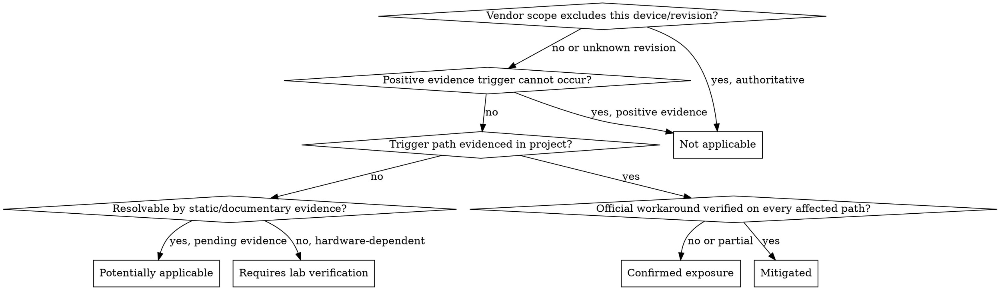

# Silicon Errata Auditor

Audit the supplied project against authoritative silicon errata and preserve an evidence chain for every conclusion.

## When not to use

- General firmware code review, bug hunting, or performance work with no specific erratum question.
- Board bring-up debugging where no vendor erratum has been implicated. Diagnose first; audit errata once a specific silicon behavior is suspected.
- Software defects already reproduced and root-caused to project code.

## Start the audit

1. Read [references/source-policy.md](references/source-policy.md) before selecting or citing sources.
2. Read [references/report-format.md](references/report-format.md) before drafting the deliverable.
3. Consult [references/investigation-playbook.md](references/investigation-playbook.md) when locating errata documents or searching the project.
4. Inventory the available device evidence, vendor documents, firmware, generated configuration, hardware files, build artifacts, and test records.
5. State the audit scope and distinguish verified facts, user-provided claims, engineering inferences, unknowns, unverified document currency, and required follow-up evidence.
6. Ask for missing information only when continuing would make the result materially unreliable. Otherwise, perform a clearly scoped preliminary analysis.

## Establish device identity

Record the most exact identity available:

- Manufacturer
- Product family
- Complete ordering code
- Package
- Die or silicon revision
- Board revision
- Relevant peripheral revisions

Never silently assume a revision. Record an unavailable field as unknown and analyze all plausibly applicable revisions.

When revision evidence is missing, request or recommend evidence from identification registers, boot logs, package markings, programmer or debugger output, manufacturing records, or board documentation. Do not invent a device-specific register address or register-reading procedure; require an authoritative vendor source before giving one.

## Build the errata set

1. Locate official errata for the exact product and revision using the source hierarchy.
2. Verify document currency from an official vendor source when network access permits. Otherwise, label currency unverified.
3. Record document identifiers, revisions, publication dates, section numbers, erratum IDs, and page numbers when available.
4. Include every entry that applies or could plausibly apply to an unknown revision. Record explicit scope exclusions.
5. Extract for each entry:
   - Erratum ID and title
   - Affected products and silicon revisions
   - Affected peripheral or subsystem
   - Triggering conditions
   - Observable failure or consequence
   - Official workaround and its limitations
   - Source citation
   - Ambiguities or missing information
6. Keep vendor statements separate from engineering interpretation. Never elevate forum posts, copied blog content, or model memory to authoritative evidence.

## Inspect the project

Search all relevant artifacts, including:

- C, C++, Rust, assembly, startup, and linker files
- Register-level code and HAL, LL, SDK, BSP, or RTOS configuration
- Devicetree, overlays, Kconfig, and generated configuration
- STM32CubeMX `.ioc`, clock-tree, PLL, DMA, interrupt, cache, memory, and low-power configuration
- Peripheral modes, wake-up paths, bootloaders, and startup code
- Schematics, nets, component options, FPGA constraints, and generated hardware configuration
- CI checks, build artifacts, tool reports, logs, and hardware test procedures

Use precise paths, symbols, configuration names, and line references. Trace configuration through build inclusion, initialization, call sites, affected runtime paths, and available runtime evidence. Do not infer that a peripheral is used merely because its driver exists. Treat generated files carefully: identify their source configuration and whether regeneration could remove a workaround.

Read the erratum's triggering condition first, then search for the specific conditions it names. [references/investigation-playbook.md](references/investigation-playbook.md) gives per-subsystem search patterns, the positive-use chain that establishes a peripheral is actually active, and the generated-configuration traps that silently remove workarounds.

## Classify applicability

The default when evidence runs out is an unresolved status, never Not applicable.

Assign every analyzed erratum exactly one status:

- **Not applicable**: Authoritative device or revision scope excludes it, or positive project evidence proves a required trigger cannot occur in the audited configuration. Do not use missing code alone as proof.
- **Potentially applicable**: The device or an unresolved plausible revision is affected, but available evidence cannot yet confirm the trigger, exposure, or complete mitigation.
- **Confirmed exposure**: The affected identity and triggering path are evidenced, and the required workaround is absent, incomplete, incorrectly timed, or invalidated.
- **Mitigated**: The affected identity and triggering path are evidenced, and the official workaround is verified on every relevant path with its limitations acknowledged.
- **Requires lab verification**: Documentary and static project evidence cannot resolve a hardware-, timing-, analog-, load-, environmental-, or runtime-dependent condition; a laboratory test is necessary to decide.

For every status, cite both device/erratum scope evidence and project evidence. Never treat absence of evidence as evidence of absence.

## Validate a workaround

Do not accept a comment, symbol name, or vendor-library presence as proof of mitigation. Verify that:

- The implementation matches the official workaround without invented requirements.
- It executes on the affected path and at the required time.
- Build options and compiler optimization cannot remove or reorder critical behavior.
- Concurrency, interrupts, DMA, caches, memory ordering, and power transitions do not invalidate it.
- It applies to the exact silicon revision.
- All vendor-stated limitations and side effects are acknowledged.

Downgrade the conclusion to the appropriate unresolved status when any required property lacks evidence.

## Recommend changes

For confirmed or potential exposure:

1. Explain the failure mechanism and cite the authoritative erratum.
2. Identify the affected code or configuration.
3. Propose the smallest reasonable mitigation.
4. Separate required changes from optional defensive improvements.
5. Explain effects on latency, throughput, power, memory, reliability, or peripheral capabilities.
6. Provide a patch only when the evidence is sufficient.
7. Mark unverified code suggestions clearly.

Never fabricate register names, bit positions, timing values, electrical limits, or vendor requirements.

## Design laboratory verification

When inspection cannot establish applicability, specify:

- Hypothesis
- Required equipment
- Firmware instrumentation
- Stimulus and operating conditions
- Relevant voltage, temperature, clock, load, and timing corners
- Measurement points
- Expected normal behavior and expected failure signature
- Repetitions or duration
- Objective pass/fail criteria
- Evidence to archive

Recommend a debugger, logic analyzer, oscilloscope, power analyzer, environmental chamber, or other equipment only when it is relevant. Tie every test condition to vendor evidence or label it as an engineering choice.

## Produce the report

Use the complete structure in [references/report-format.md](references/report-format.md). Ensure that:

- The applicability matrix contains every analyzed erratum.
- Every detailed finding traces a vendor statement to device evidence, project evidence, analysis, action, and verification.
- Citations identify exact documents and locations where available.
- Confidence reflects evidence quality rather than rhetorical certainty.
- Unknowns and required inputs remain visible.
- The report makes no claim that document currency was verified unless an official source was actually checked.

## Red flags

Each of these means the conclusion is over-claimed. Downgrade the status, lower the confidence, and record the required follow-up evidence.

| Reasoning that appears | What it actually establishes |
|---|---|
| "No call site found, so the peripheral is unused." | Nothing. Search coverage is not proof of non-use. Establish the positive use chain instead. |
| "The device is probably a recent revision." | Nothing. An unknown revision means analyzing every plausibly applicable revision. |
| "The SDK is recent, so the workaround is included." | Nothing. Locate the workaround in the built image and confirm it runs on the affected path. |
| "A comment or function name references the erratum." | Intent, not correctness, timing, or coverage. |
| "The sibling part has the same erratum." | Nothing without explicit vendor scope covering this part. |
| "This is the latest errata document." | Only true if an official index or product page was actually checked. Otherwise currency is unverified. |
| "I recall this erratum affects..." | A discovery lead only. Model memory is never an authoritative citation. |
| "The workaround is in the source tree." | Nothing about build inclusion, optimization survival, or regeneration. |

Fabricating a register name, address, bit position, timing value, electrical limit, or affected-revision list is never acceptable, even to complete a template field. Record it as unknown.
